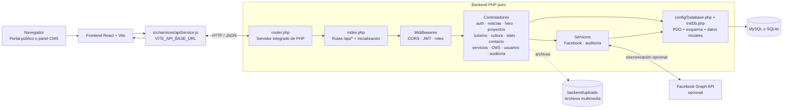

#  Portal Institucional, Panel Administrativo — Alcaldía Municipal de León, Nicaragua

Bienvenido a la documentación oficial y actualizada del sistema web completo de la **Alcaldía Municipal de León, Nicaragua**. 

Este proyecto se compone de una aplicación web fullstack:
1. **Frontend (SPA)**: React 19 + Vite 8, con portal público ciudadano y panel administrativo CMS.
2. **Backend (API REST)**: PHP puro, con acceso a datos mediante PDO y persistencia SQL en MySQL o SQLite.
3. **Integración opcional**: Importación manual de noticias desde Facebook Graph API, evitando duplicados.
4. **Seguridad y bitácora**: Autenticación JWT, control de acceso por roles (RBAC) y auditoría de cambios.

---

## Tabla de Contenidos
1. [Ficha Técnica y Tecnologías](#-ficha-técnica-y-tecnologías)
2. [Módulo CMS de Trámites y Servicios](#-módulo-cms-de-trámites-y-servicios)
3. [CMS de Centros de Atención](#-cms-de-centros-de-atención)
4. [CMS de Redes Sociales](#-cms-de-redes-sociales)
5. [Persistencia y configuración](#-persistencia-y-configuración-del-cms)
6. [Estructura Completa del Proyecto](#-estructura-completa-del-proyecto)
7. [Arquitectura del Backend](#-arquitectura-del-backend)
8. [Diagrama de la base de datos](#-diagrama-de-la-base-de-datos)
9. [Integración con Facebook Graph API](#integración-con-facebook-graph-api)
10. [Seguridad, roles y bitácora](#-seguridad-roles-y-bitácora)
11. [Autenticación y credenciales de desarrollo](#-autenticación-y-credenciales-de-desarrollo)
12. [Guía de Instalación y Ejecución](#-guía-de-instalación-y-ejecución)

---

## Ficha Técnica y Tecnologías

###  Frontend (React + Vite)
| Categoría | Tecnología | Versión | Propósito |
|---|---|---|---|
| **Framework Core** | React | `^19.2.8` | Interfaz de usuario reactiva basada en componentes |
| **Bundler / Server** | Vite | `^8.2.0` | Servidor HMR ultrarrápido y empaquetador |
| **Enrutamiento** | React Router DOM | `^7.18.2` | Rutas dinámicas y protegidas (`/`, `/admin/*`) |
| **Gestión de Estado** | TanStack React Query | `^5.102.5` | Sincronización asíncrona y caché remota |
| **Estilos & UI** | Bootstrap 5 + CSS | `^5.3.8` | Grid responsivo y componentes con Glassmorphism |
| **Notificaciones** | SweetAlert2 | `^11.26.25` | Modales interactivos de confirmación |
| **Carruseles / Mapas** | Swiper + Leaflet | `^14.1.0` / `^1.9.4` | Slider táctil y cartografía interactiva |

### Backend (PHP puro + PDO + SQL)
| Categoría | Tecnología | Versión | Propósito |
|---|---|---|---|
| **Entorno de servidor** | PHP | 8.1 o superior | API REST ejecutada con el servidor integrado de PHP o un servidor web |
| **Acceso a datos** | PDO | Extensiones `pdo_mysql` o `pdo_sqlite` | Conexión SQL y consultas preparadas |
| **Base de datos** | MySQL / SQLite | Según el entorno | Contenido del portal, usuarios, auditoría y configuración CMS |
| **Autenticación** | JWT HS256 + bcrypt | Funciones nativas de PHP | Firma de tokens y hash de contraseñas |
| **Archivos** | Sistema de archivos local | — | Imágenes cargadas en `backend/uploads`, servidas bajo `/uploads` |
| **Social Sync** | Facebook Graph API | `v19.0` | Importación manual de noticias desde Facebook |

---

##  Módulo CMS de Trámites y Servicios

Se implementó una reestructuración de la sección **Trámites y Servicios** para mejorar la experiencia de usuario (*UX*) y simplificar la navegación:

1. **4 Categorías Principales**:
   - **Trámites Municipales**: Permisos de construcción, licencias de funcionamiento y constancias.
   -  **Impuestos y Pagos**: Pago de IBI, impuesto sobre ingresos/matrícula y solvencias.
   -  **Propiedades y Comercio**: Consultas catastrales, mercados municipales y registro de negocios.
   -  **Servicios y Atención**: Recolección de basura, cementerios, denuncias y reserva de citas.
2. **Visor Modal Interactivo**:
   - Desenfoque de fondo (*Glassmorphism*), selector rápido entre categorías y tarjetas de sub-servicios con soporte para enlaces externos o redirección interna a `#contacto`.
3. **Módulo CMS Administrativo (`/admin/servicios`)**:
   - Gestión integral de categorías (crear, editar, eliminar).
   - CRUD de trámites y sub-servicios con configuración de **texto de botón** y **URL/link de destino** personalizado.
   - Edición de los textos introductorios de la sección pública y del teléfono de orientación.
   - El portal público y el CMS consultan el mismo contenido mediante React Query.

La API expone `GET /api/servicios`, `GET/PUT /api/servicios/settings`, operaciones de categorías en `/api/servicios` y operaciones de trámites en `/api/servicios/:id/subservicios`. Los registros se guardan en la base configurada; al iniciar una instalación vacía se cargan datos iniciales.

##  CMS de Centros de Atención

La pantalla `/admin/centros-atencion` permite agregar, editar y eliminar puntos de atención. Cada registro incluye nombre, etiqueta, descripción, URL de fotografía, coordenadas y enlace a Google Maps. La landing muestra esos registros en la sección `#centros-atencion`.

##  CMS de Redes Sociales

La pantalla `/admin/redes-sociales` administra el rótulo, título y descripción de la sección, además de las plataformas configuradas (Facebook, Instagram, TikTok, YouTube y Twitter/X). Para cada plataforma se pueden editar nombre, usuario, enlace oficial, contador manual, texto del contador, color, descripción de perfil e imágenes de galería.

Los enlaces, contadores y galerías de la landing se leen desde esta configuración. Los contadores son valores ingresados manualmente; no se consultan automáticamente a las redes sociales.

##  Persistencia y configuración del CMS

- **Trámites y Servicios**, **Centros de Atención** y **Redes Sociales**: se leen y guardan mediante los endpoints REST del backend.
- **Esquema y datos iniciales**: `backend/config/InitDb.php` crea las tablas compatibles con el driver activo y agrega datos iniciales al iniciar el backend.
- La conexión se configura en `backend/.env` con `DB_DRIVER` y, para MySQL, `MYSQL_HOST`, `MYSQL_PORT`, `MYSQL_USER`, `MYSQL_PASSWORD` y `MYSQL_DATABASE`. Si MySQL no está disponible, la configuración actual permite usar SQLite como alternativa.
- La API del frontend se configura con `VITE_API_BASE_URL`; por defecto usa `http://localhost:5505/api`.

---

##  Estructura Completa del Proyecto

```text
alcaldia-propuesto/
├── backend/                       ← API REST en PHP puro
│   ├── .env                       ← Configuración privada de base de datos, JWT y Facebook
│   ├── index.php                  ← Front controller y rutas de la API
│   ├── router.php                 ← Router para el servidor integrado de PHP
│   ├── start.bat / start.ps1      ← Scripts para iniciar la API en el puerto 5505
│   ├── config/
│   │   ├── Database.php           ← Conexión PDO a MySQL o SQLite
│   │   ├── InitDb.php             ← Creación de tablas y datos iniciales
│   │   └── Jwt.php                ← Firma y validación de JWT
│   ├── controllers/               ← Controladores de endpoints REST
│   ├── middlewares/               ← CORS, autenticación y permisos por rol
│   ├── services/                  ← Integraciones y auditoría
│   ├── database.sqlite            ← Base de datos local cuando se usa SQLite
│   └── uploads/                   ← Archivos multimedia cargados
├── index.html
├── vite.config.js
├── package.json                   ← Dependencias y scripts del frontend
└── src/                           ← Frontend React 19
    ├── main.jsx
    ├── App.jsx
    ├── index.css
    ├── services/
    │   ├── apiService.js          ← Cliente de API REST del backend
    │   └── initialData.js         ← Datos iniciales del CMS
    ├── components/                ← Portal público
    └── admin/                     ← Panel CMS Administrativo (/admin)
        ├── components/            ← Componentes del panel administrativo
        └── pages/                 ← Pantallas CMS
```

##  Arquitectura del Backend

El backend PHP se inicia con el servidor integrado de PHP usando `backend/router.php`; `backend/index.php` contiene el enrutamiento de la API bajo `/api`. `backend/config/Database.php` gestiona la conexión PDO. MySQL es el driver predeterminado y, si no está disponible, el backend intenta usar `backend/database.sqlite`. `backend/config/InitDb.php` crea las tablas y añade datos iniciales en las tablas vacías.

### Diagrama de componentes y flujo de una petición

El frontend no consulta la base de datos directamente. Las llamadas HTTP pasan por `src/services/apiService.js`, llegan al router PHP y se procesan en los controladores. Los middlewares aplican CORS, autenticación y permisos; los controladores acceden a la base SQL mediante PDO.



### Módulos de API

| Prefijo | Responsabilidad principal |
|---|---|
| `/api/auth` | Inicio de sesión, usuario autenticado y cambio de contraseña |
| `/api/noticias` | Consulta y administración de noticias |
| `/api/hero` | Contenido principal del portal |
| `/api/proyectos` | Proyectos municipales |
| `/api/turismo` | Destinos y contenido turístico |
| `/api/cultura` | Agenda y contenido cultural |
| `/api/stats` | Estadísticas publicadas |
| `/api/contacto` | Información institucional y redes |
| `/api/servicios` | Categorías de servicios, trámites y configuración |
| `/api/cms` | Contenido del CMS, incluidos centros de atención y redes sociales |
| `/api/users` | Gestión de cuentas y roles |
| `/api/audit-logs` | Consulta de la bitácora |
| `/api/facebook` | Sincronización manual con Facebook |

Los archivos subidos se sirven en `/uploads`. La sincronización de Facebook es opcional y manual desde el panel o mediante `POST /api/facebook/sync`; requiere `FACEBOOK_PAGE_ID` y `FACEBOOK_ACCESS_TOKEN`.

##  Diagrama de la base de datos

El backend crea el esquema al iniciar mediante `backend/config/InitDb.php`; la definición se ajusta al driver PDO activo (MySQL o SQLite). El diagrama muestra las entidades principales del CMS.


`CMS_CONTENT` guarda documentos JSON identificados por `id` (por ejemplo, `centros-atencion` y `redes-sociales`). `SERVICIOS_SETTINGS` es una configuración independiente para los textos y teléfono de la sección de servicios. `ACTIVITY_LOGS.userId` identifica al usuario asociado al evento cuando está disponible, pero no tiene FK declarada.

---

##  Seguridad, roles y bitácora

### Matriz de Roles (RBAC)
* **`superadmin`**: Acceso total al sistema (gestión de usuarios, auditoría, contenidos y configuración).
* **`editor`**: Permisos de creación y edición de noticias, proyectos, turismo y cultura.
* **`visor`**: Perfil de solo lectura.

### Bitácora de Auditoría (`activity_logs`)
Las acciones auditadas generan registros en la tabla `activity_logs`, que guarda:
`id`, `userEmail`, `userName`, `role`, `action`, `module`, `details`, `ip` y `timestamp`.

El middleware valida la firma y expiración del JWT, y rechaza solicitudes privadas sin token o con token inválido. Las rutas de Usuarios, Auditoría y Servicios aplican controles de rol; otras rutas de contenido actualmente exigen autenticación, pero no todas filtran por rol.

---

## Integración con Facebook Graph API

La integración es opcional y la sincronización se inicia manualmente desde el panel o mediante `POST /api/facebook/sync`. Al ejecutarla, el backend consulta Facebook Graph API v19.0, importa publicaciones con texto y omite las que ya existen usando `external_id`. Para habilitarla, configura `FACEBOOK_PAGE_ID` y `FACEBOOK_ACCESS_TOKEN` en `backend/.env`. No hay una tarea automática programada en el backend.

---

##  Autenticación y credenciales de desarrollo

* **URL predeterminada de la API Backend**: `http://localhost:5505/api`
* **URL predeterminada del Frontend React**: `http://localhost:5173`
* **Credenciales locales iniciales** (solo para desarrollo):
  * **Correo**: `admin@alcaldaleon.gob.ni`
  * **Contraseña**: `admin123`

El middleware rechaza solicitudes privadas sin un JWT válido. Configura un `JWT_SECRET` propio antes de desplegar. El frontend conserva el JWT devuelto por la API para autenticar las solicitudes administrativas.

---

##  Guía de Instalación y Ejecución

Para probar la aplicación localmente necesitas **PHP 8.1 o superior**, **Node.js** para el frontend y un driver PDO habilitado para tu base de datos (`pdo_mysql` o `pdo_sqlite`). El backend se ejecuta en PHP puro; no necesita Express, Composer ni un paquete de backend de Node.js. Con XAMPP se ejecutan tres componentes: XAMPP (Apache y MySQL), el backend PHP y el frontend Vite.

### Fedora con XAMPP (configuración local del proyecto)

En el equipo de desarrollo, XAMPP está instalado en `/opt/lampp` y el servicio MariaDB de Fedora está desactivado para evitar que compita por el puerto `3306`. En Fedora se requieren las bibliotecas compatibles que usa este paquete de XAMPP:

```bash
sudo dnf install libxcrypt-compat libnsl
```

Inicia XAMPP (Apache, MariaDB y ProFTPD):

```bash
sudo /opt/lampp/lampp start
```

Abre [phpMyAdmin](http://localhost/phpmyadmin), entra con el usuario `root` y contraseña vacía, y selecciona la base `alcaldia_leon`. Si hay que crearla, ejecuta en la pestaña SQL:

```sql
CREATE DATABASE IF NOT EXISTS alcaldia_leon
  CHARACTER SET utf8mb4 COLLATE utf8mb4_unicode_ci;
```

La configuración de XAMPP usada por el backend en `backend/.env` es:

```env
DB_DRIVER=mysql
MYSQL_HOST=127.0.0.1
MYSQL_PORT=3306
MYSQL_USER=root
MYSQL_PASSWORD=
MYSQL_DATABASE=alcaldia_leon
```

En este entorno local, `MYSQL_PASSWORD=` queda intencionalmente vacío, como es habitual en XAMPP recién instalado. No uses esa cuenta sin contraseña en un servidor público. No inicies al mismo tiempo el servicio MariaDB de Fedora: ambos servidores usan el puerto `3306`.

Abre el backend en una terminal:

```bash
cd ~/alcaldia-propuesto/backend
php -S 127.0.0.1:5505 router.php
```

En otra terminal, inicia el frontend:

```bash
cd ~/alcaldia-propuesto
npm run dev
```

Vite muestra la dirección efectiva al arrancar. Si el puerto `5173` ya está ocupado, Vite selecciona otro, por ejemplo `5174`. Abre esa dirección para el portal y añade `/admin/login` para el panel administrativo. El backend está en [http://localhost:5505/api/health](http://localhost:5505/api/health); el JSON debe indicar `"database":"mysql"`. La primera solicitud inicializa las tablas, que luego pueden consultarse en phpMyAdmin.

### Windows con XAMPP

Estos pasos asumen que XAMPP está instalado en `C:\xampp`. Si lo instalaste en otra carpeta, reemplaza esa ruta por la correcta.

1. **Inicia MySQL y Apache:** abre el **XAMPP Control Panel** y pulsa **Start** en las filas de **MySQL** y **Apache**. Ambos deben quedar marcados como activos. ProFTPD no se necesita para este proyecto.
2. **Crea la base de datos:** abre [http://localhost/phpmyadmin](http://localhost/phpmyadmin), entra a la pestaña **SQL** y ejecuta:
   ```sql
   CREATE DATABASE IF NOT EXISTS alcaldia_leon
     CHARACTER SET utf8mb4 COLLATE utf8mb4_unicode_ci;
   ```
3. **Configura el backend:** en `backend/.env`, deja la conexión de XAMPP así. En la instalación local habitual, `root` no tiene contraseña:
   ```env
   DB_DRIVER=mysql
   MYSQL_HOST=127.0.0.1
   MYSQL_PORT=3306
   MYSQL_USER=root
   MYSQL_PASSWORD=
   MYSQL_DATABASE=alcaldia_leon
   ```
   No uses una cuenta `root` sin contraseña fuera del equipo local.
4. **Inicia el backend en una terminal de PowerShell:** desde la carpeta raíz del proyecto ejecuta:
   ```powershell
   cd .\backend
   & "C:\xampp\php\php.exe" -S 127.0.0.1:5505 router.php
   ```
   Deja esta terminal abierta. Usar el PHP incluido en XAMPP asegura que se utilice su extensión `pdo_mysql`.
5. **Inicia el frontend en otra terminal de PowerShell:** desde la carpeta raíz del proyecto:
   ```powershell
   npm ci
   npm run dev
   ```
   `npm ci` solo hace falta la primera vez o después de cambiar las dependencias. Deja abierta la terminal y usa la dirección que Vite indique. Normalmente es `http://localhost:5173`; si ese puerto está ocupado puede mostrar `5174`.

Con los tres servicios activos, abre la URL del frontend que mostró Vite. La API debe responder en [http://localhost:5505/api/health](http://localhost:5505/api/health) con `"database":"mysql"`. El backend crea las tablas al recibir la primera solicitud; para verlas, actualiza phpMyAdmin y selecciona `alcaldia_leon`. El panel de administración está en la ruta `/admin/login` del mismo host y puerto del frontend.

### Publicar en un hosting con panel (cPanel o Plesk)

Los nombres de menús y rutas varían según el proveedor. Antes de contratar o subir el proyecto, confirma que el plan incluya **PHP 8.1 o superior**, **MySQL/MariaDB**, PDO MySQL, Apache con `mod_rewrite` y permisos de escritura para la carpeta de imágenes. El servidor integrado `php -S` y `npm run dev` son solo para desarrollo; no se dejan corriendo en producción.

La distribución siguiente supone que el sitio y la API se publican bajo el mismo dominio:

- Sitio: `https://tudominio.com/`
- API: `https://tudominio.com/api/`

1. **Crea una base MySQL en el panel.** En cPanel usa *MySQL Database Wizard*; en Plesk usa *Databases*. Crea la base y un usuario propio, asigna ese usuario a la base con los permisos que el backend necesite para crear y modificar tablas, y guarda el nombre completo, usuario, contraseña y host que muestra el proveedor. En muchos cPanel se antepone el usuario de la cuenta al nombre de base y al usuario.
2. **Configura el backend antes de subirlo.** En `backend/.env`, sustituye los valores locales de XAMPP por los datos del hosting:
   ```env
   DB_DRIVER=mysql
   MYSQL_HOST=HOST_MYSQL_DEL_PROVEEDOR
   MYSQL_PORT=3306
   MYSQL_USER=USUARIO_MYSQL_DEL_PANEL
   MYSQL_PASSWORD=CONTRASEÑA_MYSQL_DEL_PANEL
   MYSQL_DATABASE=BASE_MYSQL_DEL_PANEL
   JWT_SECRET=SECRETO_ALEATORIO_LARGO_Y_UNICO
   FRONTEND_URL=https://tudominio.com
   ```
   Genera un secreto aleatorio nuevo (por ejemplo, con `openssl rand -hex 32`) y no reutilices las credenciales locales de XAMPP. El backend necesita leer este archivo en su carpeta raíz. Si esa carpeta está bajo `public_html`, bloquéalo mediante `.htaccess` y verifica desde el navegador que `https://tudominio.com/api/.env` devuelva `403` o `404`, nunca el contenido del archivo.
3. **Compila el frontend para la URL pública de la API.** Desde la raíz del proyecto, en una terminal con Node.js:
   ```bash
   npm ci
   VITE_API_BASE_URL=https://tudominio.com/api npm run build
   ```
   En PowerShell de Windows, configura la variable para ese comando así:
   ```powershell
   $env:VITE_API_BASE_URL = "https://tudominio.com/api"
   npm ci
   npm run build
   Remove-Item Env:VITE_API_BASE_URL
   ```
   La compilación genera `dist/`. Si cambias el dominio o la URL de la API, vuelve a compilar y subir el frontend: Vite incorpora esa URL en los archivos generados.
4. **Sube el frontend.** Mediante el Administrador de archivos del panel o SFTP, sube el **contenido** de `dist/` (no la carpeta `dist` como subcarpeta) a `public_html/` o al directorio público equivalente. Incluye archivos ocultos como `.htaccess` si existen.
5. **Sube el backend.** Coloca el contenido necesario de `backend/` en `public_html/api/` para que la entrada de la API sea `https://tudominio.com/api/`. Incluye `config/`, `controllers/`, `middlewares/`, `services/`, `uploads/`, `index.php` y `router.php`. No subas `adminer.php`, `database.sqlite` ni archivos de configuración local que no necesite el servidor. El proveedor debe ejecutar PHP y permitir las extensiones PDO MySQL.
6. **Configura las rutas de Apache.** Si no hay reglas equivalentes, crea `public_html/.htaccess` para las rutas SPA del frontend y para exponer las imágenes que el backend guarda en `api/uploads/`:
   ```apache
   RewriteEngine On
   RewriteRule ^api(/.*)?$ - [L]
   RewriteRule ^uploads/(.*)$ api/uploads/$1 [L]
   RewriteCond %{REQUEST_FILENAME} -f [OR]
   RewriteCond %{REQUEST_FILENAME} -d
   RewriteRule ^ - [L]
   RewriteRule ^ index.html [L]
   ```
   Crea también `public_html/api/.htaccess` para enviar las rutas REST al front controller y bloquear el archivo de secretos:
   ```apache
   Options -Indexes
   <Files ".env">
       Require all denied
   </Files>
   RewriteEngine On
   RewriteCond %{REQUEST_FILENAME} !-f
   RewriteCond %{REQUEST_FILENAME} !-d
   RewriteRule ^ index.php [QSA,L]
   ```
   Estas reglas requieren Apache con `mod_rewrite` y `AllowOverride` habilitado. Si el hosting usa Nginx o rechaza `.htaccess`, solicita al proveedor las reglas equivalentes para SPA, API y bloqueo de archivos ocultos; no continúes dejando `.env` accesible.
7. **Ajusta permisos y HTTPS.** La carpeta `public_html/api/uploads/` debe poder recibir archivos por PHP, pero no debe permitir ejecutar scripts subidos. Activa el certificado HTTPS del hosting y usa HTTPS para el sitio y la API.
8. **Verifica la instalación.** Abre `https://tudominio.com/api/health`; debe responder con `"database":"mysql"`. Una respuesta `"database":"sqlite"` significa que la conexión MySQL falló: revisa el log PHP y las credenciales del panel antes de guardar contenido. Comprueba la portada, `/admin/login`, la carga de imágenes y que las tablas aparezcan en phpMyAdmin.

Antes de abrir el sitio al público, cambia o elimina las credenciales de administrador iniciales de desarrollo, usa un `JWT_SECRET` propio y cambia `backend/middlewares/CorsMiddleware.php` para permitir solo el origen HTTPS del frontend (actualmente permite cualquier origen). No dejes phpMyAdmin ni Adminer expuestos públicamente sin las protecciones del proveedor. Los planes compartidos pueden limitar cargas de archivos o creación automática de tablas; si algo falla, consulta los límites y logs de PHP del panel.

### 1. Configurar la base de datos

MySQL es el driver predeterminado. Crea la base de datos si aún no existe:

```bash
mysql -u root -p
```

En el prompt de MySQL:

```sql
CREATE DATABASE IF NOT EXISTS alcaldia_leon;
EXIT;
```

Configura `backend/.env` con los valores de tu entorno:

```env
DB_DRIVER=mysql
MYSQL_HOST=localhost
MYSQL_PORT=3306
MYSQL_USER=root
MYSQL_PASSWORD=tu_contraseña_mysql
MYSQL_DATABASE=alcaldia_leon
JWT_SECRET=un_secreto_largo_y_aleatorio
```

En una instalación local de XAMPP donde `root` no tiene contraseña, deja `MYSQL_PASSWORD=` vacío. El lector de configuración conserva ese valor vacío.

El backend crea las tablas y los datos iniciales al arrancar mediante `backend/config/InitDb.php`. No subas contraseñas ni secretos al repositorio.

Para usar SQLite en desarrollo, configura `DB_DRIVER=sqlite` en `backend/.env`; el archivo de base de datos es `backend/database.sqlite`. PHP debe tener habilitada la extensión PDO correspondiente al driver elegido. Para comprobar las extensiones cargadas:

```powershell
php -m
```

### 2. Iniciar el Backend

En Windows puedes ejecutar el script incluido:

```powershell
.\backend\start.bat
```

O iniciar el servidor integrado de PHP desde la carpeta `backend`:

```powershell
cd backend
php -S 0.0.0.0:5505 router.php
```

El backend estará disponible en `http://localhost:5505`. Comprueba que responde en `http://localhost:5505/api/health`:

```bash
curl http://localhost:5505/api/health
```

### 3. Iniciar el Frontend

Desde otra terminal en la raíz del proyecto:

```bash
npm ci
npm run dev
```

Vite mostrará la dirección local del frontend, normalmente `http://localhost:5173`. El frontend consulta por defecto `http://localhost:5505/api`.

Si cambias el puerto del backend, configura `VITE_API_BASE_URL` para que apunte a la nueva dirección:

```bash
VITE_API_BASE_URL=http://localhost:5506/api npm run dev
```

### 4. Probar y consultar datos

- **Estado del backend:** `GET http://localhost:5505/api/health`
- **Noticias desde la API:** `GET http://localhost:5505/api/noticias`
- **Inicio de sesión del panel:** `POST http://localhost:5505/api/auth/login`

Para consultar MySQL directamente:

```bash
mysql -h localhost -P 3306 -u root -p alcaldia_leon
```

Dentro de MySQL, lista las tablas y consulta sus registros:

```sql
SHOW TABLES;
SELECT * FROM noticias;
```

Sustituye `noticias` por otra tabla mostrada por `SHOW TABLES;`. Puedes limitar una consulta con `LIMIT 20`, por ejemplo `SELECT * FROM noticias LIMIT 20;`. Sal con `EXIT;`.

Credenciales locales iniciales para el panel:

- Correo: `admin@alcaldaleon.gob.ni`
- Contraseña: `admin123`

Úsalas solo en desarrollo; cambia o elimina estas credenciales antes de desplegar en producción.
