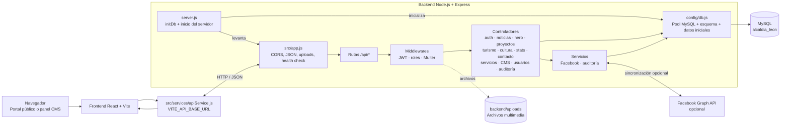

#  Portal Institucional, Panel Administrativo — Alcaldía Municipal de León, Nicaragua

Bienvenido a la documentación oficial y actualizada del sistema web completo de la **Alcaldía Municipal de León, Nicaragua**. 

Este proyecto se compone de una aplicación web fullstack:
1. **Frontend (SPA)**: Desarrollado con **React 19** + **Vite 8**, que incluye un portal público ciudadano de alto impacto visual y un **Panel Administrativo (CMS Dashboard)**.
2. **Backend (API REST)**: Desarrollado con **Node.js** + **Express.js**, con persistencia centralizada en **MySQL**.
3. **Módulo de Sincronización Automática**: Conexión con **Facebook Graph API** para importación de noticias sin duplicados.
4. **Seguridad & Bitácora**: Control de acceso por roles (RBAC) y Registro de Auditoría de Cambios (*Audit Logs*).

---

## Tabla de Contenidos
1. [Ficha Técnica y Tecnologías](#-ficha-técnica-y-tecnologías)
2. [Módulo CMS de Trámites y Servicios](#-módulo-cms-de-trámites-y-servicios)
3. [CMS de Centros de Atención](#-cms-de-centros-de-atención)
4. [CMS de Redes Sociales](#-cms-de-redes-sociales)
5. [Persistencia y configuración](#-persistencia-y-configuración-del-cms)
6. [Estructura Completa del Proyecto](#-estructura-completa-del-proyecto)
7. [Arquitectura del Backend](#-arquitectura-del-backend)
8. [Diagrama de la base de datos](#-diagrama-de-la-base-de-datos)
9. [Módulo de Sincronización con Facebook Graph API](#-módulo-de-sincronización-con-facebook-graph-api)
10. [Seguridad, roles y bitácora](#-seguridad-roles-y-bitácora)
11. [Autenticación y credenciales de desarrollo](#-autenticación-y-credenciales-de-desarrollo)
12. [Guía de Instalación y Ejecución](#-guía-de-instalación-y-ejecución)

---

## Ficha Técnica y Tecnologías

###  Frontend (React + Vite)
| Categoría | Tecnología | Versión | Propósito |
|---|---|---|---|
| **Framework Core** | React | `^19.2.8` | Interfaz de usuario reactiva basada en componentes |
| **Bundler / Server** | Vite | `^8.2.0` | Servidor HMR ultrarrápido y empaquetador |
| **Enrutamiento** | React Router DOM | `^7.18.2` | Rutas dinámicas y protegidas (`/`, `/admin/*`) |
| **Gestión de Estado** | TanStack React Query | `^5.102.5` | Sincronización asíncrona y caché remota |
| **Estilos & UI** | Bootstrap 5 + CSS | `^5.3.8` | Grid responsivo y componentes con Glassmorphism |
| **Notificaciones** | SweetAlert2 | `^11.26.25` | Modales interactivos de confirmación |
| **Carruseles / Mapas** | Swiper + Leaflet | `^14.1.0` / `^1.9.4` | Slider táctil y cartografía interactiva |

###  Backend (Node.js + Express + MySQL)
| Categoría | Tecnología | Versión | Propósito |
|---|---|---|---|
| **Entorno de Servidor** | Node.js (ESM) | `v20+` | Entorno de ejecución de lado del servidor |
| **Framework Web** | Express.js | `^4.21.2` | Infraestructura de rutas y middleware de API REST |
| **Base de Datos** | MySQL | `mysql2` `^3.11.0` | Persistencia de contenido, usuarios, auditoría y configuración CMS |
| **Almacenamiento Multimedia** | Multer + disco local | `multer` `^1.4.5-lts.1` | Las imágenes de noticias se guardan en `backend/uploads` y se sirven bajo `/uploads` |
| **Seguridad & Token** | JWT + bcryptjs | `^9.0.2` / `^3.0.3` | Encriptación de contraseñas y firma de tokens de sesión |
| **Social Sync** | Facebook Graph API | `v19.0` | Importación automática de noticias desde Facebook |

---

##  Módulo CMS de Trámites y Servicios

Se implementó una reestructuración de la sección **Trámites y Servicios** para mejorar la experiencia de usuario (*UX*) y simplificar la navegación:

1. **4 Categorías Principales**:
   - **Trámites Municipales**: Permisos de construcción, licencias de funcionamiento y constancias.
   -  **Impuestos y Pagos**: Pago de IBI, impuesto sobre ingresos/matrícula y solvencias.
   -  **Propiedades y Comercio**: Consultas catastrales, mercados municipales y registro de negocios.
   -  **Servicios y Atención**: Recolección de basura, cementerios, denuncias y reserva de citas.
2. **Visor Modal Interactivo**:
   - Desenfoque de fondo (*Glassmorphism*), selector rápido entre categorías y tarjetas de sub-servicios con soporte para enlaces externos o redirección interna a `#contacto`.
3. **Módulo CMS Administrativo (`/admin/servicios`)**:
   - Gestión integral de categorías (crear, editar, eliminar).
   - CRUD de trámites y sub-servicios con configuración de **texto de botón** y **URL/link de destino** personalizado.
   - Edición de los textos introductorios de la sección pública y del teléfono de orientación.
   - El portal público y el CMS consultan el mismo contenido mediante React Query.

La API expone `GET /api/servicios`, `GET/PUT /api/servicios/settings`, operaciones de categorías en `/api/servicios` y operaciones de trámites en `/api/servicios/:id/subservicios`. Los registros y su configuración se guardan en MySQL; al iniciar una instalación vacía se cargan los datos iniciales de `src/services/initialData.js`.

##  CMS de Centros de Atención

La pantalla `/admin/centros-atencion` permite agregar, editar y eliminar puntos de atención. Cada registro incluye nombre, etiqueta, descripción, URL de fotografía, coordenadas y enlace a Google Maps. La landing muestra esos registros en la sección `#centros-atencion`.

##  CMS de Redes Sociales

La pantalla `/admin/redes-sociales` administra el rótulo, título y descripción de la sección, además de las plataformas configuradas (Facebook, Instagram, TikTok, YouTube y Twitter/X). Para cada plataforma se pueden editar nombre, usuario, enlace oficial, contador manual, texto del contador, color, descripción de perfil e imágenes de galería.

Los enlaces, contadores y galerías de la landing se leen desde esta configuración. Los contadores son valores ingresados manualmente; no se consultan automáticamente a las redes sociales.

##  Persistencia y configuración del CMS

- **Trámites y Servicios**: la API `/api/servicios` usa MySQL, incluidas sus categorías, opciones y configuración.
- **Centros de Atención** y **Redes Sociales**: se leen y guardan en MySQL mediante `GET/PUT /api/cms/centros-atencion` y `GET/PUT /api/cms/redes-sociales`. Los cambios quedan compartidos entre los clientes conectados al backend.
- Las demás secciones del CMS usan endpoints REST del backend; las credenciales de conexión se definen solo en `backend/.env` mediante `MYSQL_HOST`, `MYSQL_PORT`, `MYSQL_USER`, `MYSQL_PASSWORD` y `MYSQL_DATABASE`.
- La API del frontend se configura con `VITE_API_BASE_URL`; por defecto usa `http://localhost:5000/api`. En el servidor Vite se debe definir la variable antes de arrancar, por ejemplo `VITE_API_BASE_URL=http://localhost:5001/api`.

---

##  Estructura Completa del Proyecto

```text
alcaldia-leon-react/
├── backend/                       ← SERVIDOR BACKEND (Node.js + Express + MySQL)
│   ├── .env                       ← Configuración privada MySQL, JWT y Facebook opcional
│   ├── package.json
│   ├── server.js                  ← Entrypoint + Cron Job de Sincronización (Puerto 5000)
│   ├── uploads/                   ← Almacenamiento local temporal / fallback
│   └── src/
│       ├── app.js                 ← Configuración de Express, CORS y montaje de rutas API
│       ├── config/
│       │   └── db.js              ← Pool MySQL, creación de tablas y datos iniciales
│       ├── controllers/
│       │   ├── authController.js  ← Login JWT, encriptación bcrypt y cambio de clave
│       │   ├── serviciosController.js ← Categorías, trámites y textos de Servicios
│       │   ├── cmsContentController.js← Centros de atención y redes sociales
│       │   ├── noticiasController.js ← CRUD de noticias + Auditoría
│       │   ├── proyectosController.js← CRUD de proyectos
│       │   ├── turismoController.js  ← CRUD de destinos turísticos
│       │   ├── culturaController.js  ← CRUD de agenda cultural
│       │   ├── statsController.js    ← CRUD de estadísticas demográficas
│       │   ├── contactoController.js ← Edición de datos institucionales
│       │   ├── facebookController.js ← Sincronización bajo demanda con Facebook
│       │   ├── auditController.js    ← Consulta de bitácora de eventos
│       │   └── usersController.js    ← Gestión de administradores y roles RBAC
│       ├── middlewares/
│       │   ├── authMiddleware.js  ← Protección JWT de rutas privadas
│       │   ├── roleMiddleware.js  ← Control de acceso por roles (RBAC)
│       │   └── uploadMiddleware.js← Carga de imágenes con Multer
│       ├── services/
│       │   ├── facebookService.js ← Conector con Facebook Graph API y filtro anti-duplicados
│       │   └── auditService.js    ← Servicio de registro de auditoría (activity_logs)
│       └── routes/
│           ├── authRoutes.js      ← Rutas /api/auth
│           ├── serviciosRoutes.js ← CRUD /api/servicios y control de acceso
│           ├── noticiasRoutes.js  ← Rutas /api/noticias
│           ├── proyectosRoutes.js ← Rutas /api/proyectos
│           ├── turismoRoutes.js   ← Rutas /api/turismo
│           ├── culturaRoutes.js   ← Rutas /api/cultura
│           ├── statsRoutes.js     ← Rutas /api/stats
│           ├── contactoRoutes.js  ← Rutas /api/contacto
│           ├── facebookRoutes.js  ← Rutas /api/facebook
│           ├── auditRoutes.js     ← Rutas /api/audit-logs
│           ├── usersRoutes.js     ← Rutas /api/users
│           └── cmsContentRoutes.js← Rutas /api/cms
│
├── index.html
├── vite.config.js
├── package.json                   ← Dependencias del Frontend
└── src/                           ← FRONTEND (React 19)
    ├── main.jsx
    ├── App.jsx
    ├── index.css
    ├── services/
    │   ├── apiService.js          ← Cliente de API REST del backend
    │   └── initialData.js         ← Datos iniciales del CMS
      ├── components/                ← Portal público; incluye CentrosAtencion y RedesSociales
    └── admin/                     ← Panel CMS Administrativo (/admin)
        ├── components/            ← Layout, Sidebar y Header de Administración
         └── pages/                 ← Incluye ServiciosAdmin, CentrosAtencionAdmin y RedesSocialesAdmin
```

##  Arquitectura del Backend

El backend Express se inicia desde `backend/server.js`, monta sus endpoints bajo `/api` y conecta con MySQL usando el pool `mysql2`. Al iniciar crea las tablas requeridas y siembra contenido inicial solo donde todavía no hay registros. Si MySQL no está disponible, el servidor no inicia; configura las variables `MYSQL_*` en `backend/.env`.

### Diagrama de componentes y flujo de una petición

El frontend no consulta MySQL directamente. Las llamadas HTTP pasan por el cliente `apiService.js`, llegan a Express y las rutas las distribuyen a controladores. Los middlewares aplican las validaciones configuradas para cada ruta; los controladores usan el pool MySQL o los servicios de integración.



### Módulos de API

| Prefijo | Responsabilidad principal |
|---|---|
| `/api/auth` | Inicio de sesión, usuario autenticado y cambio de contraseña |
| `/api/noticias` | Consulta y administración de noticias |
| `/api/hero` | Contenido principal del portal |
| `/api/proyectos` | Proyectos municipales |
| `/api/turismo` | Destinos y contenido turístico |
| `/api/cultura` | Agenda y contenido cultural |
| `/api/stats` | Estadísticas publicadas |
| `/api/contacto` | Información institucional y redes |
| `/api/servicios` | Categorías de servicios, trámites y configuración |
| `/api/cms` | Contenido del CMS, incluidos centros de atención y redes sociales |
| `/api/users` | Gestión de cuentas y roles |
| `/api/audit-logs` | Consulta de la bitácora |
| `/api/facebook` | Sincronización manual con Facebook |

Los archivos subidos se sirven en `/uploads`. La sincronización programada con Facebook se activa solo si se configuran `FACEBOOK_PAGE_ID` y `FACEBOOK_ACCESS_TOKEN`.

##  Diagrama de la base de datos

El esquema se crea y verifica al iniciar el backend, mediante `backend/src/config/db.js`. El diagrama muestra las tablas y sus claves principales; **la única relación declarada con clave foránea actualmente es `subservicios.servicio_id` → `servicios.id`**. Las demás referencias conceptuales, como `activity_logs.userId`, no tienen una restricción FK en el esquema.

```mermaid
erDiagram
    USERS {
        varchar id PK
        varchar name
        varchar email UK
        varchar password
        varchar role
        varchar avatar
        timestamp created_at
        timestamp updated_at
    }

    NOTICIAS {
        varchar id PK
        varchar titulo
        varchar slug
        text extracto
        text contenido
        varchar categoria
        text imagen
        varchar autor
        varchar status
        varchar fuente
        varchar external_id
        timestamp created_at
        timestamp updated_at
    }

    HERO {
        varchar id PK
        text title
        text subtitle
        text video_url
        text fallback_image_url
        boolean is_active
        timestamp updated_at
    }

    PROYECTOS {
        varchar id PK
        varchar title
        varchar category
        varchar status
        int progress
        boolean is_published
        timestamp created_at
        timestamp updated_at
    }

    TURISMO {
        varchar id PK
        varchar title
        varchar category
        varchar location
        text content
        boolean is_published
        int display_order
    }

    CULTURA {
        varchar id PK
        varchar title
        varchar event_date
        varchar event_time
        varchar location
        text image_url
        boolean is_published
    }

    STATS {
        varchar id PK
        varchar title
        bigint number
        varchar category
        json breakdown
        boolean is_published
        int display_order
    }

    CONTACTO {
        varchar id PK
        text address
        varchar phone
        varchar email
        varchar schedule
        varchar facebook_url
        varchar instagram_url
        timestamp updated_at
    }

    SERVICIOS {
        varchar id PK
        varchar title
        varchar subtitle
        text desc
        int count
        int display_order
    }

    SUBSERVICIOS {
        varchar id PK
        varchar servicio_id FK
        varchar title
        text desc
        varchar linkText
        varchar linkUrl
    }

    SERVICIOS_SETTINGS {
        varchar id PK
        varchar eyebrow
        varchar title
        text description
        varchar phone
    }

    ACTIVITY_LOGS {
        varchar id PK
        varchar userId
        varchar userEmail
        varchar userName
        varchar role
        varchar action
        varchar module
        text details
        varchar ip
        timestamp timestamp
    }

    CMS_CONTENT {
        varchar id PK
        json content
        timestamp updated_at
    }

    SERVICIOS ||--o{ SUBSERVICIOS : "contiene (FK)"
```



`CMS_CONTENT` guarda documentos JSON identificados por `id` (por ejemplo, `centros-atencion` y `redes-sociales`). `SERVICIOS_SETTINGS` es una configuración independiente para los textos y teléfono de la sección de servicios. `ACTIVITY_LOGS.userId` identifica al usuario asociado al evento cuando está disponible, pero no tiene FK declarada.

---

##  Seguridad, roles y bitácora

### Matriz de Roles (RBAC)
* **`superadmin`**: Acceso total al sistema (gestión de usuarios, auditoría, contenidos y configuración).
* **`editor`**: Permisos de creación y edición de noticias, proyectos, turismo y cultura.
* **`visor`**: Perfil de solo lectura.

### Bitácora de Auditoría (`activity_logs`)
Cada acción dentro del sistema (crear noticia, editar proyecto, eliminar registro, login exitoso o fallido) genera un registro en la tabla MySQL `activity_logs`, que guarda:
`id`, `userEmail`, `userName`, `role`, `action`, `module`, `details`, `ip` y `timestamp`.

El middleware valida la firma y expiración del JWT, y rechaza solicitudes privadas sin token o con token inválido. Las rutas de Usuarios, Auditoría y Servicios aplican controles de rol; otras rutas de contenido actualmente exigen autenticación, pero no todas filtran por rol.

---

##  Módulo de Sincronización con Facebook Graph API

* **Cron Job en Segundo Plano**: Si se configuran `FACEBOOK_PAGE_ID` y `FACEBOOK_ACCESS_TOKEN`, el servidor consulta cada 30 minutos la página oficial de la Alcaldía de León.
* **Filtro Anti-Duplicación**: Consulta `external_id` en la tabla MySQL `noticias` para ignorar publicaciones ya registradas.
* **Sincronización Manual**: Los administradores pueden forzar la sincronización en tiempo real con 1 solo clic desde el CMS.

---

##  Autenticación y credenciales de desarrollo

* **URL predeterminada de la API Backend**: `http://localhost:5000/api`
* **URL predeterminada del Frontend React**: `http://localhost:5173`
* **Credenciales locales de demostración** (no usar en producción):
  * **Correo**: `admin@alcaldaleon.gob.ni`
  * **Contraseña**: `admin123`

El middleware de autenticación rechaza solicitudes privadas sin un JWT válido. En producción se debe configurar `JWT_SECRET`; el secreto predeterminado solo se usa en desarrollo. El frontend conserva el JWT devuelto por la API para autenticar las solicitudes administrativas.

---

##  Guía de Instalación y Ejecución

Para probar la aplicación localmente necesitas tener **Node.js** y **MySQL** instalados, y el servicio de MySQL iniciado. El frontend y el backend se ejecutan al mismo tiempo en **dos terminales diferentes**. Los comandos siguientes parten de la carpeta raíz del proyecto.

### 1. Preparar MySQL

Crea la base de datos si todavía no existe:

```bash
mysql -u root -p
```

En el prompt de MySQL:

```sql
CREATE DATABASE IF NOT EXISTS alcaldia_leon;
EXIT;
```

Configura `backend/.env` con los valores de tu entorno:

```env
MYSQL_HOST=localhost
MYSQL_PORT=3306
MYSQL_USER=root
MYSQL_PASSWORD=tu_contraseña_mysql
MYSQL_DATABASE=alcaldia_leon
JWT_SECRET=un_secreto_local
```

No subas este archivo con contraseñas o secretos al repositorio. Al arrancar, el backend verifica y crea las tablas que falten, y agrega datos de demostración en las tablas vacías.

### 2. Iniciar el Backend (Terminal 1)

Desde la raíz del proyecto:

```bash
cd backend
npm ci
npm run dev
```

Deja esta terminal abierta. Cuando indique que el servidor está corriendo, el backend estará disponible en `http://localhost:5000`. Comprueba que responde visitando `http://localhost:5000/api/health` o ejecutando:

```bash
curl http://localhost:5000/api/health
```

Si aparece `EADDRINUSE` en el puerto `5000`, ya hay otro proceso usando ese puerto. Detén la otra instancia del backend o configura un puerto diferente en `backend/.env` y cambia la URL de API del frontend.

### 3. Iniciar el Frontend (Terminal 2)

Abre otra terminal, desde la raíz del proyecto:

```bash
npm ci
npm run dev
```

Vite mostrará la dirección local del frontend, normalmente `http://localhost:5173`. Abre esa URL en el navegador. Por defecto, el frontend consulta el backend en `http://localhost:5000/api`.

Para usar un puerto distinto para el backend, configura `VITE_API_BASE_URL` al iniciar Vite. Por ejemplo:

```bash
VITE_API_BASE_URL=http://localhost:5001/api npm run dev -- --port 5174
```

### 4. Probar y consultar datos

- **Estado del backend:** `GET http://localhost:5000/api/health`
- **Noticias desde la API:** `GET http://localhost:5000/api/noticias`
- **Inicio de sesión del panel:** `POST http://localhost:5000/api/auth/login`

En una tercera terminal también puedes consultar MySQL directamente:

```bash
mysql -h localhost -P 3306 -u root -p alcaldia_leon
```

Dentro de MySQL, lista las tablas y consulta sus registros:

```sql
SHOW TABLES;
SELECT * FROM noticias;
```

Sustituye `noticias` por el nombre de otra tabla mostrada por `SHOW TABLES;`. Puedes limitar una consulta grande con `LIMIT 20`, por ejemplo `SELECT * FROM noticias LIMIT 20;`. Sal con `EXIT;`.

Credenciales locales de demostración para el panel:

- Correo: `admin@alcaldaleon.gob.ni`
- Contraseña: `admin123`

Úsalas solo en desarrollo; cambia o elimina estas credenciales antes de desplegar en producción.
